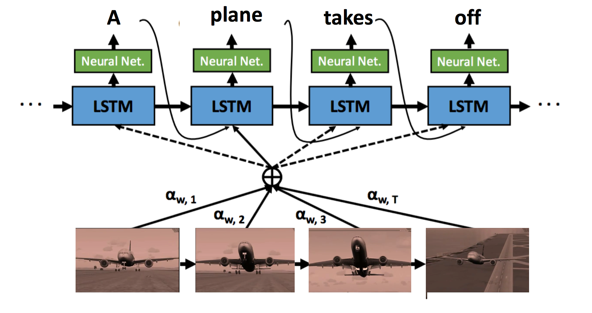

# SA-tensorflow
Tensorflow implementation of soft-attention mechanism for video caption generation. 
<center>

An example of soft-attention mechanism. The attention weight alpha indicates the temporal attention in one video based on each word.  
</center>

[[Yao et al. 2015 Describing Videos by Exploiting Temporal Structure]](http://arxiv.org/abs/1502.08029)
The original code implemented in Torch can be found [here](https://github.com/yaoli/arctic-capgen-vid).
# Prerequisites
* Python 2.7
* [Tensorflow](https://www.tensorflow.org/) >= 0.7.1
* NumPy
* pandas
* keras
* java 1.8.0

# Data
We pack the data into the format of HDF5, where each file is a mini-batch for training and has the following keys:
```
[u'data', u'fname', u'label', u'title']
```

```batch['data']``` stores the visual features. ```shape (n_step_lstm, batch_size, hidden_dim) ```

```batch['fname']``` stores the filenames(no extension) of videos. ```shape (batch_size)```

```batch['title']``` stores the description. If there are multiple sentences correspond to one video, the other metadata such as visual features, filenames and labels have to duplicate for one-to-one mapping. ```shape (batch_size)```

```batch['label']``` indicates where the video ends. For instance, ```[-1., -1., -1., -1.,  0., -1., -1.]``` means that the video ends at index 4.

```shape (n_step_lstm, batch_size)```

## Generate HDF5 data 

We generate the HDF5 data by following the steps below. The codes are a little messy. If you have any questions, feel free to ask. 

### 1. Generate Label

Once you change the ```video_path``` and ```output_path```, you can generate labels by running the script:
 
```
python hdf5_generator/generate_nolabel.py
```

I set the length of each clip to 10 frames and the maximum length of frames to 450. You can change the parameters in function `get_frame_list(frame_num)`.

### 2. Pack features together (no caption information)

#### Inputs:

```label_path```: The path for the labels generated earlier.

```feature_path```: The path that stores features such as VGG and C3D. 
You can change the directory name whatever you want.


#### Ouputs:

```h5py_path```: The path that you store the concatenation of different features, the code will automatically put the features in the subdirectory `cont`

```
python hdf5_generator/input_generator.py
```

Note that in function `get_feats_depend_on_label()`, you can choose whether to take the mean feature or random sample feature of frames in one clip. The random sample script is commented out since the performance is worse.

### 3. Add captions into HDF5 data

I set the maxmimum number of words in a caption to 35. `feature folder` is where our final output features store.

```
python hdf5_generator/trans_video_youtube.py
```
(The codes here are written by Kuo-Hao)

## Generate data list 

```
video_data_path_train = '$ROOTPATH/SA-tensorflow/examples/train_vn.txt'
```

You can change the path variable to the absolute path of your data. Then simply run ```python getlist.py``` to generate the list.

P.S. The filenames of HDF5 data start with ```train```, ```val```, ```test```. 

# Usage

## training
```
$ python Att.py --task train
```
## testing
Test the model after a certain number of training epochs.

```
$ python Att.py --task test --net models/model-20
```
# Author
[Tseng-Hung Chen](https://tsenghungchen.github.io/)

[Kuo-Hao Zeng](https://kuohaozeng.github.io/)

# Disclaimer

We modified the code from this repository [jazzsaxmafia/video\_to\_sequence](https://github.com/jazzsaxmafia/video_to_sequence) to the temporal-attention model.

# References

[1] L. Yao, A. Torabi, K. Cho, N. Ballas, C. Pal, H. Larochelle, and A. Courville. 
Describing videos by exploiting temporal structure. arXiv:1502.08029v4, 2015.

[2] chen:acl11,
  title = "Collecting Highly Parallel Data for Paraphrase Evaluation",
  author = "David L. Chen and William B. Dolan",
  booktitle = "Proceedings of the 49th Annual Meeting of the Association for Computational Linguistics (ACL-2011)",
  address = "Portland, OR",
  month = "June",
  year = 2011

[3] [Microsoft COCO Caption Evaluation](https://github.com/tylin/coco-caption)
